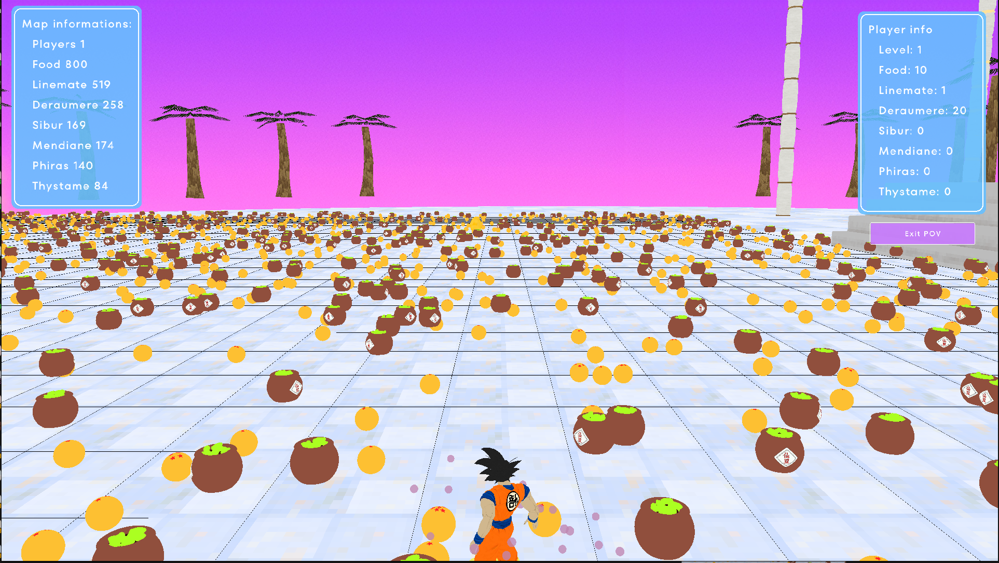

# Zappy 🐉

A real-time multiplayer network game where AI-controlled players compete to reach the highest evolution level on planet Trantor. Features a 3D graphical interface with Dragon Ball Z theme.

```ascii
 ________   ______  ____    ____    __    __ 
/\_____  \ /\  _  \/\  _`\ /\  _`\ /\ \  /\ \
\/____//'/'\ \ \L\ \ \ \L\ \ \ \L\ \ `\`\\/'/
     //'/'  \ \  __ \ \ ,__/\ \ ,__/`\ `\ /' 
    //'/'___ \ \ \/\ \ \ \/  \ \ \/   `\ \ \ 
    /\_______\\ \_\ \_\ \_\   \ \_\     \ \_\
    \/_______/ \/_/\/_/\/_/    \/_/      \/_/                                  
```

## 🎮 Overview

Zappy is a team-based strategy game where multiple AI clients control Trantorians (inhabitants) on a resource-rich planet. The goal is to be the first team with at least 6 players reaching the maximum elevation level through strategic resource collection and ritual incantations.

### 🌟 Key Features

- **Multi-threaded Server** - Handles multiple AI and GUI clients simultaneously using poll-based socket multiplexing
- **Autonomous AI Players** - Self-governing clients with strategic decision-making and team coordination
- **3D Visualization** - Real-time Dragon Ball Z themed GUI built with Raylib
- **Resource Management** - Dynamic spawning system with 7 different resource types
- **Team Coordination** - Broadcasting system for player communication
- **Elevation System** - 8-level progression system requiring strategic cooperation

## 🚀 Quick Start

### Prerequisites

- **C Compiler** (gcc/clang)
- **C++17** compatible compiler
- **Python 3.7+**
- **Raylib** (for GUI)
- **Make**
- POSIX compliant system (Linux/macOS)

### Installation

```bash
# Clone the repository
git clone https://github.com/LorisDXB/zappy_mirror.git
cd zappy_mirror

# Build all components
make

# Or build individually
make zappy_server
make zappy_gui
make zappy_ai
```

### Running the Game

1. **Start the Server:**
```bash
./zappy_server -p 4242 -x 20 -y 20 -n team1 team2 -c 5 -f 100
```

2. **Launch the GUI (optional):**
```bash
./zappy_gui -p 4242 -h localhost
```

3. **Connect AI Players:**
```bash
# Connect multiple AI clients for different teams
./zappy_ai -p 4242 -n team1 -h localhost
./zappy_ai -p 4242 -n team2 -h localhost
```

## 🎯 Game Mechanics

### Resources
- **Food** (Senzu Beans) - Survival resource
- **Stones** (Dragon Balls) - 6 types for elevation rituals
  - Linemate, Deraumere, Sibur, Mendiane, Phiras, Thystame

### Elevation Levels
Players progress through 8 levels by performing incantation rituals with specific resource and player requirements:

| Level | Players Required | Description |
|-------|-----------------|-------------|
| 1→2 | 1 | Basic elevation |
| 2→3 | 2 | Team coordination begins |
| 3→4 | 2 | Advanced resource management |
| 4→5 | 4 | Mid-game complexity |
| 5→6 | 4 | Strategic planning required |
| 6→7 | 6 | Near end-game |
| 7→8 | 6 | Final elevation |

## 🛠️ Development

### Server Commands

The server accepts real-time commands via stdin:

- `/clients` - List connected clients
- `/map` - Display map information
- `/pause` - Pause AI actions
- `/setTile <resource> <quantity> <x> <y>` - Modify tile
- `/tp <id> <x> <y>` - Teleport player
- [See full list in documentation]

### Protocols

#### AI Client Protocol
```
Server -> WELCOME\n
Client -> TEAM_NAME\n
Server -> CLIENT_NUM\n
Server -> X Y\n
```

#### GUI Client Protocol
```
Server -> WELCOME\n
Client -> GRAPHIC\n
Server -> [Game state data]
```

## 📊 Performance

- Single-threaded server with non-blocking I/O
- Supports 100+ concurrent clients
- Real-time synchronization at configurable frequency (default: 100 Hz)
- Optimized pathfinding and vision algorithms

## 🎨 GUI Features

- **3D Dragon Ball Z Theme**
  - Player transformations (Goku forms based on level)
  - Shenron appears during incantations
  - Dragon Balls as collectible stones
- **Multiple Camera Modes**
  - Free camera with WASD controls
  - Top-down strategic view
  - Player POV mode
- **Interactive Elements**
  - Click to select players/eggs
  - Real-time resource counters
  - Broadcast visualization

## 🤖 AI Strategy

The AI implements sophisticated strategies including:
- Priority-based decision making
- Resource optimization algorithms
- Team coordination through broadcasts
- Intelligent forking for team expansion
- Pathfinding with BFS algorithm

## 📚 Documentation

Detailed documentation is available for each component:

- [Server Documentation](documentation/Server/Server-Documentation.md) - Server architecture, protocols, and API
- [GUI Documentation](documentation/GUI/GUI-Documentation.md) - GUI features, controls, and rendering
- [AI Documentation](documentation/AI/AI-Documentation.md) - AI strategies, algorithms, and implementation

## 🐛 Troubleshooting

### Common Issues

1. **Connection Refused**
   - Ensure server is running on specified port
   - Check firewall settings

2. **GUI Models Not Loading**
   - Verify `assets/` directory is present
   - Check file permissions

3. **AI Not Responding**
   - Maximum 10 queued commands
   - Check server frequency setting

## 📄 License

This project is licensed under the MIT License - see the LICENSE file for details.

## 👥 Authors

- **Adrien Gaillard-Lafargue** - *Server* - [Github](https://github.com/agaillardlafargue)
- **Loris Godé** - *Server* - [Github](https://github.com/LorisDXB)
- **Gobijan Nathakrishnan** - *AI* - [Github](https://github.com/GobyNathan)
- **Keyvan Goddard** - *AI* - [Github](https://github.com/EtaLoop)
- **Perrine Feyt** - *GUI* - [Github](https://github.com/pepsicoo)
- **Noé Roberties** - *GUI* - [Github](https://github.com/NoeRoberties)

## 🙏 Acknowledgments

- Epitech for the project specifications
- Dragon Ball Z for visual inspiration
- Raylib community for graphics support

## 📸 Screenshots




---
